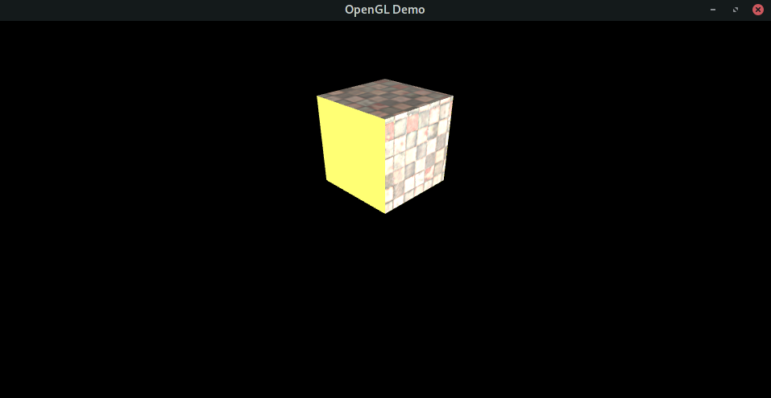
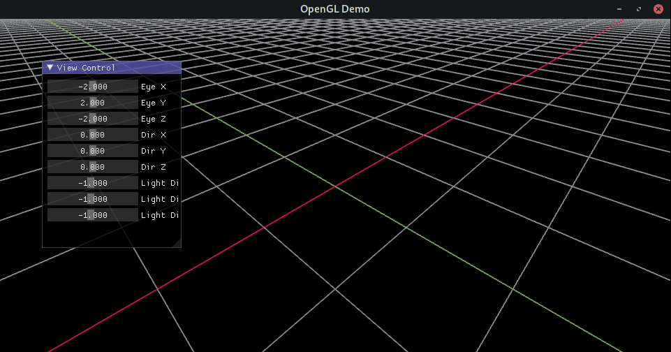

# gl3d

Useful OpenGL code fragments! For fast building of OpenGL program.

## Description

Support win32, linux. Use cmake to complete compilation.

Watch out copy .dll in win32 environment.

The short-term targets:

- Research OpenGL API
- Import 3D model
- Matrix transform
- OpenGL performance optimization
- Model control
- Skeleton binding
- Light line rendering
- Particle effect
- Post-production
- Build scene

## Custom C/C++ interface

| Header | Intro |
| ---- | ---- |
| shader.h | GLSL compilation |
| graph.h | Vertices coordinate generator of several common geometry |
| D3.h | 3D Model importing via assimp |
| smartfs.hpp | Simplify file searching |
| basic_ops.hpp | C++ utilities |
| coords.hpp | coordinate drawing |
| glm_helper.h | Help to print matrix/vector of glm |
| kinematics.hpp | Custom kinematics engine |
| skybox.hpp | skybox rendering |

## Use cases

Summary of several small demos:

| Name | Description |
| ---- | ---- |
| glDemo | simple demo for using vao, vbo, ebo, texture, glsl, etc. |
| moDemo | simple demo for using assimp to import 3D model via a hand-writing obj file. |
| imDemo | simple model control, interactive-form, and draw coordinate. |
| skyDemo | simple model for creating cube texture, sky box, etc. |
| sphereDemo | simple model for making vertices of a sphere freely! |
| hdrDemo | panorama picture unfolding |
| kineticDemo | simple kinematics simulation, two linkages mechanism. |
| jointBindDemo | human skeletons binding, based on multi linkages structure. |

## Build

```
./build.sh             # compile
./build/glDemo/glDemo  # run glDemo
```

## Demo

glDemo


imDemo
